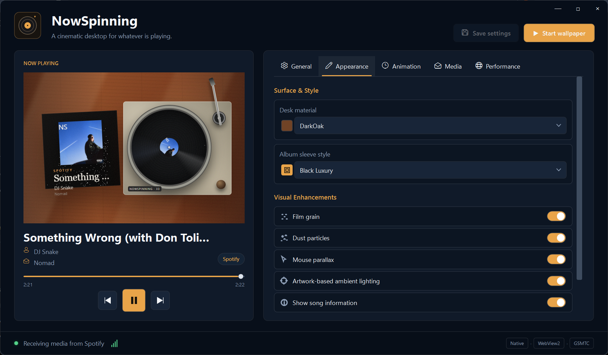

# Wynil

Wynil is an original Windows 10/11 live wallpaper that turns the current Windows media session into a cinematic top-down turntable scene. It uses C#/.NET 8, WPF, Windows GSMTC, WebView2, TypeScript, and Vite. Basic Spotify, browser, YouTube, Apple Music, SoundCloud, and other compatible playback detection requires no service-specific login.



## Features

- Event-driven `GlobalSystemMediaTransportControlsSessionManager` detection and deterministic active-session selection
- Title, artist, album, source, playback state, timeline, capabilities, and session artwork
- Original responsive wooden-desk scene with animated 33⅓ RPM vinyl, tonearm, sleeve transitions, center label, reflections, grain, and parallax
- Native WorkerW wallpaper windows for every connected monitor with click-through desktop interaction
- Hold **Alt** to temporarily expose playback controls over the turntable
- Play/pause, previous, and next commands routed back to the active Windows media session
- Modern settings window, JSON configuration, system tray lifecycle, and optional startup registration
- Deduplicated artwork cache, expiration/size trimming support, and palette/contrast extraction
- Authenticated loopback browser fallback with strict message validation and payload limits
- Optional NAudio WASAPI loopback level analysis; no audio is stored or transmitted
- Opt-in audio-reactive visuals that subtly drive vinyl wobble, ambient lighting, dust, and tonearm movement
- Lively Wallpaper export using the same production frontend and authenticated local companion
- Self-contained x64 release and Inno Setup installer with conditional WebView2 installation
- Developer simulation mode and automated coverage for configuration, session selection, layout, messages, palettes, and state transitions

## Architecture

```text
Windows media sessions ─┐
                       ├─ Wynil.Media ── immutable MediaTrack snapshots
Browser extension ─────┘                            │
                                                   ▼
WPF settings/tray ── Wynil.App ── Wynil.Wallpaper
                                                   │ typed JSON
                                                   ▼
                                      WebView2 / Lively TypeScript scene
```

- `Wynil.Core`: dependency-free models, configuration, MVVM, palette, and monitor calculations
- `Wynil.Media`: GSMTC, session selection, artwork cache, browser server, simulation, and loopback analysis
- `Wynil.Wallpaper`: WebView2 bridge, WorkerW integration, per-monitor windows, and interaction hotkey
- `Wynil.Settings`: startup registration and settings boundaries
- `Wynil.App`: WPF composition root, settings UI, tray, and safe shutdown
- `Wynil.Frontend`: responsive Vite/TypeScript scene

## Run and install

The compiled setup is at `artifacts/installer/Wynil-Setup-1.0.0.exe`. It offers optional desktop/startup shortcuts, includes a self-contained .NET runtime, and runs the official WebView2 Evergreen bootstrapper only when WebView2 is missing.

For development:

```powershell
npm install --prefix src/Wynil.Frontend
npm run build --prefix src/Wynil.Frontend
dotnet build Wynil.sln -c Release
dotnet test Wynil.sln -c Release --no-build
dotnet run --project src/Wynil.App/Wynil.App.csproj
```

Build every release artifact:

```powershell
powershell -ExecutionPolicy Bypass -File scripts/build.ps1 -Configuration Release -Installer
```

The temporary product name and default behavior live in `src/Wynil.App/appsettings.json`. Per-user changes are written atomically to `%LocalAppData%\Wynil\settings.json`.

## Browser fallback

1. Run the desktop companion once. It creates `%LocalAppData%\Wynil\browser-token.txt` with a random 256-bit token.
2. Open the browser extension manager, enable developer mode, and load `browser-extension` as an unpacked extension.
3. Open the extension options and paste the token.

The server binds only to `127.0.0.1:17842`, compares tokens in constant time, accepts text metadata only, sanitizes control characters, limits messages to 6 MiB, and never executes received markup or script.

## Lively Wallpaper

Run the release build, then execute `lively-package/configure-lively.ps1`. Import the `lively-package` folder into Lively and keep the Wynil companion running. The helper adds the current account's random viewer token to the local package metadata.

## Troubleshooting

- **No song appears:** verify the application exposes a media entry in Windows quick settings. Otherwise install the optional browser bridge.
- **Wallpaper does not appear:** restart Windows Explorer, pause/resume from the tray, and confirm WebView2 Runtime is installed.
- **Desktop icons stop accepting clicks:** release Alt. Stopping the wallpaper from the tray closes all child windows and restores Explorer ownership.
- **Browser bridge cannot connect:** keep Wynil running, verify port 17842 is free, and recopy the current token into extension options.
- **Artwork is missing:** the publishing application did not provide a thumbnail. Wynil intentionally does not scrape unofficial artwork sites.
- **High GPU usage:** choose 30 FPS, low-power mode, reduce motion, and disable dust/parallax in settings.

## Known Windows limitations

- WorkerW is an undocumented Explorer implementation detail and can change in a Windows update. The host rediscovers it each time wallpaper mode starts.
- GSMTC metadata and controls are supplied by the source application; artwork, album, seeking, previous, or next can be unavailable.
- DRM media, elevated applications, private sessions, and legacy players may not publish metadata or loopback samples.
- Mixed-DPI coordinates are normalized through native monitor bounds, but Explorer restarts and display-topology changes require restarting wallpaper mode.
- The authenticated Lively token is specific to one Windows account and should not be shared with a package distributed to another computer.
- The generated installer is not code-signed. Windows SmartScreen may warn until a trusted signing certificate is applied.

## Privacy

Media metadata and cached artwork remain on the computer. Audio-reactive mode samples loopback levels in memory and does not record audio. No analytics, cloud API, artwork scraping, or external listening port is used.
